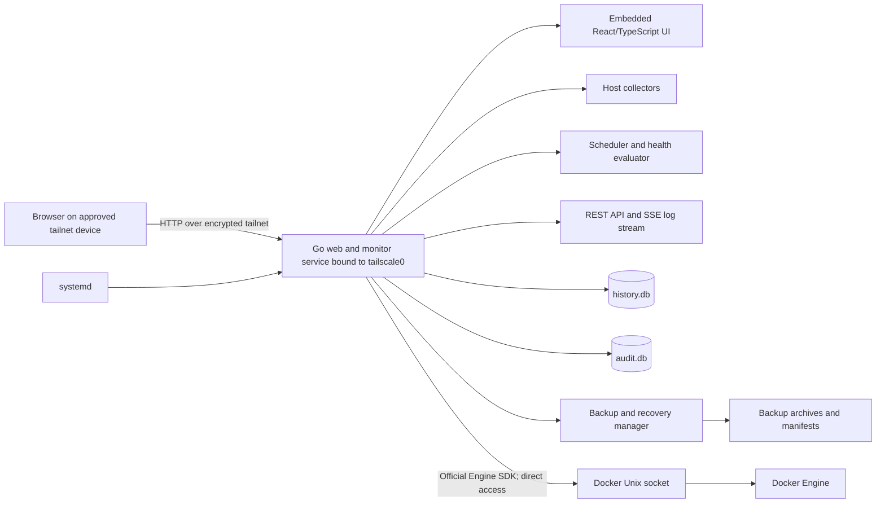

# Infrastructure Monitor — Technical Plan

Status: **Approved for task-by-task implementation**
Based on: `PROJECT_CONTEXT.md`, approved 2026-08-03
Last updated: 2026-08-04
Implementation: **Only explicitly started tasks are authorized**

## Executive recommendation

Build a self-hosted Go application with an embedded React/TypeScript single-page interface and two local SQLite databases. The Go service listens directly on the VPS Tailscale address over HTTP; no public listener, public domain, TLS certificate, or reverse proxy is required.

Use one Go release artifact in one application systemd service. The service owns the API, host and Docker collection, scheduling, history, exports, backup/recovery, and embedded frontend. As explicitly approved, it accesses the Docker Unix socket directly.

This is deliberately a modular monolith, not microservices. It needs no PostgreSQL, Redis, message broker, Kubernetes, cloud database, or hosted monitoring platform.

The workspace already contains a tracked Python/Next/Vinext/Cloudflare Sites prototype. That prototype monitors a Windows workstation, is read-only, and uses a different architecture from the approved context. The recommended path is to preserve it in Git, then replace its runtime architecture rather than operate two competing backends.

## Recommended technology stack

| Area | Recommendation | Why it is needed |
|---|---|---|
| Backend language | Current supported stable Go release | Confirmed project choice; efficient, statically typed, well suited to Linux services, and produces a simple Linux executable. |
| HTTP server/router | Go standard library `net/http` | Current Go routing supports method and path patterns. The API is small enough that Gin, Fiber, or another framework would add little value. |
| Frontend packaging | Go `embed` | Packages the compiled frontend into the Go executable, giving one versioned application artifact and an atomic frontend/backend rollout. |
| Frontend | React + TypeScript | React fits a stateful dashboard with several pages, controls, charts, and live-log behavior. TypeScript is already confirmed and helps keep API/UI contracts explicit. |
| Frontend build | Vite | A focused SPA build tool with an official React/TypeScript path. Server-side rendering and Next.js are unnecessary for a private dashboard with no SEO requirement. |
| Routing | React Router | Provides clear routes for overview, CPU, RAM, disks, containers, events, audit, exports, backups, and recovery. |
| Server-state handling | TanStack Query | Manages API fetching, one-minute refresh, retries, cache invalidation after actions, stale UI state, and request cancellation without a general-purpose state store. |
| Charts | Apache ECharts | Canvas rendering is practical for thousands of time-series points and mobile use. Provide text summaries because chart ARIA support alone is insufficient. |
| Localization | i18next + react-i18next | Supports complete English/French resources, browser-language detection, runtime switching, plurals, and formatting. |
| Styling | CSS Modules plus global CSS variables | Enough for a single dark responsive product; avoids introducing a large UI framework. |
| Icons | Lucide React | Consistent accessible status/action icons without hand-authored SVG components. |
| Host metrics | gopsutil v4 plus small Linux-specific `/proc` readers | gopsutil covers CPU, memory, disks, partitions, and I/O. Direct readers cover PSI and any Linux fields that the library does not expose precisely. |
| Docker integration | Official Docker Engine Go SDK | Official version-negotiated access to container list, inspect, stats, logs, and start/stop/restart operations directly from the Go service. |
| Main storage | SQLite in WAL mode | One VPS, one writer, moderate data, local backups, no database server administration. WAL permits chart reads while minute samples are written. |
| Go SQLite driver | `modernc.org/sqlite` through `database/sql` | CGo-free driver keeps Linux builds and release artifacts simpler. Pin and test its exact dependency versions. |
| SQL access | Hand-written SQL behind repository interfaces | The schema and query set are understandable; an ORM would hide important time-series and retention behavior. |
| Schema migrations | Embedded versioned SQL migrations, applied by a small established migration library such as Goose | Makes upgrades explicit and testable without writing a custom migration engine. |
| Configuration | TOML settings file | More comfortable for administrator editing than JSON and less surprising than YAML. Validate fully before atomically accepting it. |
| Live logs | Server-Sent Events (SSE) from Go to the browser | Logs are one-way server-to-browser streams. SSE is simpler than WebSockets and reconnects naturally. |
| Service management | systemd | Starts services on boot, restarts crashes, applies service hardening, owns runtime directories, and integrates logs with journald. |
| Host firewall | Existing UFW or nftables policy | Allows the configured HTTP port only on the Tailscale interface and blocks the public and unrelated interfaces. Do not install a second competing firewall manager. |
| Backend tests | Go `testing`, `httptest`, and race detector | Standard, fast, and sufficient for domain, repository, API, collector, and concurrency tests. |
| Frontend tests | Vitest + React Testing Library | Component and interaction tests using the Vite toolchain. |
| End-to-end tests | Playwright | Automates main workflows in Chromium and Firefox. Opera GX receives an additional smoke test using its installed executable. |

### Technologies intentionally not selected

- **Next.js or Vinext:** SSR, React Server Components, edge deployment, and SEO are unnecessary here.
- **Cloudflare Sites/D1/R2:** the production app must read local Linux and Docker state and be reachable only through the tailnet. A public/hosted frontend creates the wrong security and data boundary.
- **PostgreSQL or a time-series database:** excessive operational overhead for one host and 14 days of one-minute samples.
- **Redis or a message queue:** collection and web requests run in one local application; there is no distributed coordination problem.
- **Prometheus/Grafana:** capable alternatives, but they would not directly satisfy Docker administration, custom recovery, bilingual workflow, audit deletion, and the defined product UI without adding more systems.
- **Docker Compose for the monitor itself:** containerizing the monitor makes accurate host inspection and Docker socket isolation harder. Native systemd services are clearer for this host-level tool.
- **Kubernetes:** no need for orchestration on a single VPS.
- **Caddy or another reverse proxy:** unnecessary after the user explicitly accepted HTTP inside the encrypted tailnet. The Go server can bind directly to the Tailscale address.

## Important alternatives and trade-offs

### Backend router

- **Recommended:** Go `net/http`. Few dependencies and enough routing/middleware capability.
- **Alternative:** Chi. Cleaner middleware composition and route grouping, but it is another dependency for a problem the standard library can handle.
- **Not recommended:** Gin/Fiber. Their convenience does not justify a second framework model for this API size.

### SQLite driver

- **Recommended:** `modernc.org/sqlite`, which avoids CGo and simplifies reproducible Linux builds.
- **Alternative:** `mattn/go-sqlite3`, very mature and often faster, but requires a C compiler and CGo for builds.
- Before final dependency locking, benchmark the chosen driver with representative mount/container counts and verify that its backup support can create consistent snapshots.

### Docker privilege boundary

- **Approved:** give the Go web/monitor service direct Docker socket access through membership in the Docker-access group. This removes a helper process, but a compromise of the web service may provide root-equivalent control of the VPS through Docker.
- **Safer alternative, not selected:** separate Docker helper over a Unix socket. The web process would be restricted to a small allowlist of operations.
- **External alternative:** a Docker socket proxy. This avoids custom helper code but adds another deployed product and a broader HTTP-style configuration surface.

### Browser transport

- **Approved:** HTTP bound only to the Tailscale interface/address. Tailscale encrypts traffic between tailnet devices, while the browser may still show a "Not secure" indicator.
- **Future alternative:** add browser-trusted HTTPS if the user later chooses a public domain with DNS-01 or installs a private CA on every supported client.
- HTTP must never be used as justification for a wildcard/public listener. Interface binding, Headscale policy, and host-firewall enforcement are mandatory.

### Frontend framework

- **Recommended:** React with Vite. It matches the existing frontend skills/assets and has strong testing and ecosystem support.
- **Alternative:** Svelte. Less component boilerplate and smaller output, but it introduces a new frontend model and reduces reuse from the existing React prototype.
- **Alternative:** plain TypeScript. Lowest dependency count, but the number of pages, live states, charts, controls, and localization makes manual UI state management less maintainable.

## High-level architecture



### Request and data flow

1. A tailnet-connected browser connects to the Go service's private Tailscale address or approved tailnet name over HTTP.
2. At startup, the Go service resolves the active IPv4 address on `tailscale0` and fails closed instead of falling back to a wildcard/public listener.
3. The Go service serves the embedded SPA and a same-origin `/api/v1` API.
4. Every minute, the scheduler collects host measurements and reads Docker measurements directly through the Docker Engine SDK.
5. One transaction writes the minute's data and collection result to `history.db`.
6. The health evaluator opens, closes, or updates incidents from that committed sample.
7. The dashboard reads current and historical data through bounded queries. Long chart ranges are aggregated to a display-sized number of points while exports retain raw minute samples.
8. Docker logs pass from Docker through the Go SSE endpoint to the browser without database storage. Each open viewer keeps at most 5 MiB and discards its oldest displayed content when full.
9. Administrative actions are written to `audit.db`, which is separate from monitoring-history backups.

## Main components and responsibilities

### 1. Go web and monitor service

- Serve the embedded frontend.
- Expose versioned REST endpoints.
- Stream live container logs over SSE.
- Discover and bind only to the active IPv4 address on `tailscale0`; fail startup if that secure bind cannot be established.
- Apply security headers and conservative request-size limits directly.
- Use the direct TCP peer address for audit attribution; ignore forwarded-client headers.
- Run the collection scheduler, retention, backup schedule, and settings watcher.
- Maintain the last successful in-memory snapshot for fast overview reads.
- Read/write SQLite through repository packages.
- Continue serving degraded and recovery views when a collector or history database fails.

### 2. Host collector

- Collect overall and per-vCPU usage, load averages, memory fields, swap, PSI, mounts, capacity, permissions, and block-device I/O.
- Dynamically detect CPU and mount changes instead of hard-coding six CPUs.
- Associate mounts with block devices when possible.
- Mark unsupported virtual-filesystem measurements unavailable rather than failing the whole collection.
- Apply per-collector timeouts and return structured partial results.

### 3. Docker integration

- Run inside the main Go service using direct access to the local Docker Unix socket.
- Expose only product endpoints for these approved operations:
  - list and inspect existing containers;
  - read stats, state, health, ports, uptime, and restart count;
  - read and follow logs;
  - start, stop, and restart an existing container.
- Do not expose application endpoints for create, delete, rename, exec, attach, image, volume, network-management, secret, or arbitrary Engine API operations.
- Validate container identifiers and impose timeouts, response-size limits, and stream cancellation.
- Use Docker API version negotiation.
- Treat Docker group/socket access as root-equivalent. The application-level operation list reduces accidental exposure but is not a security boundary after a Go-service compromise.

### 4. Health evaluator

- Evaluate confirmed warning and Critical thresholds only after a sample transaction commits.
- Track simultaneous Healthy/Warning/Critical/Unknown conditions.
- Open an incident on the first qualifying sample and close it on the first normal sample.
- Treat Docker communication and database failures according to the approved context.
- Keep incident logic pure and heavily unit-tested.

### 5. History repository

- Own all `history.db` SQL.
- Write each collection run in a single short transaction.
- Query raw data for short ranges and server-aggregated min/average/max buckets for long chart ranges.
- Stream raw rows for exports instead of loading an entire export into memory.
- Run bounded retention deletes and SQLite maintenance.

### 6. Audit repository

- Store administrative records independently in `audit.db`.
- Support selected, date-range, and all-record deletion.
- Insert the deletion audit record after the selected deletion transaction.
- Remain outside normal history backups as explicitly required.

### 7. Backup and recovery manager

- Create scheduled and manual consistent history snapshots.
- Include settings and last-valid settings; exclude `audit.db` and container logs.
- Generate a manifest containing format version, application version, timestamps, sizes, and SHA-256 checksums.
- Validate database integrity and archive checksums before declaring success.
- Scan manifests directly so the recovery page works if `history.db` is unavailable.
- Enter maintenance mode for restore, create a safety copy, validate the selected backup, replace through atomic renames, reopen storage, and roll back automatically if validation fails.

### 8. Settings manager

- Watch the administrator-edited TOML file.
- Parse into a candidate object and validate every field before changing live state.
- Atomically swap the full settings snapshot; never partially apply a file.
- Save a protected last-valid copy for invalid-startup recovery.
- Debounce duplicate filesystem notifications and audit success/failure once per actual change.

### 9. Export service

- Validate dataset and time range against the 14-day window.
- Stream CSV or JSON using bounded database cursors.
- Apply cancellation, one concurrent export per client, and a maximum request duration.
- Audit requested format, datasets, time range, result, and requesting IP without logging exported content.

### 10. React frontend

- Own presentation, navigation, localization, responsive layout, confirmation dialogs, and live-log controls.
- Use TanStack Query for server data; avoid Redux or another global store.
- Keep only non-authoritative preferences, such as selected language, in browser storage.
- Never treat browser confirmation as authorization; the server still validates every action.
- Show explicit loading, empty, stale, unavailable, success, and failure states.

## Suggested folder structure

```text
Personal Infrastructure Monitor/
├── cmd/
│   └── pim/                    # one application executable
├── internal/
│   ├── api/                    # HTTP handlers, SSE, middleware
│   │   └── contracts/          # versioned response and action contracts
│   ├── app/                    # startup, shutdown, dependency wiring
│   ├── audit/                  # audit domain and repository
│   ├── backup/                 # backup manifests, safety copies, restore workflow
│   ├── collector/
│   │   ├── host/               # CPU, RAM, PSI, filesystems, block I/O
│   │   └── docker/             # direct Docker SDK collection and controls
│   ├── config/                 # TOML schema, validation, watch, last-valid copy
│   ├── domain/                 # shared backend domain types and invariants
│   ├── export/                 # streaming CSV and JSON
│   ├── health/                 # thresholds, statuses, incident state machine
│   ├── scheduler/              # minute collection, cleanup, backups, catch-up
│   ├── storage/
│   │   ├── history/            # history repositories and queries
│   │   ├── audit/              # separate audit database
│   │   └── migrations/         # embedded ordered SQL migrations
│   └── web/                    # embedded compiled frontend assets
├── web/
│   ├── src/
│   │   ├── api/                # typed API client and contracts
│   │   ├── components/         # reusable cards, badges, charts, dialogs
│   │   ├── features/           # cpu, memory, disks, docker, logs, events, backups
│   │   ├── i18n/               # English/French resources and completeness checks
│   │   ├── pages/              # route-level screens
│   │   ├── styles/             # dark tokens and responsive globals
│   │   └── test/               # frontend test setup
│   ├── index.html
│   ├── package.json
│   ├── package-lock.json
│   ├── tsconfig.json
│   ├── vite.config.ts
│   └── vitest.config.ts
├── configs/
│   └── settings.example.toml
├── deploy/
│   ├── systemd/
│   └── firewall/               # reviewed examples, not an automatic destructive script
├── docs/
│   ├── api-contracts.md
│   ├── operations.md
│   ├── recovery.md
│   └── security-boundaries.md
├── tests/
│   ├── integration/
│   ├── e2e/
│   └── fixtures/
├── scripts/
│   └── quality.mjs             # cross-platform quality command implementation
├── PROJECT_CONTEXT.md
├── TECHNICAL_PLAN.md
├── go.mod
├── go.sum
└── package.json                # discoverable cross-platform quality entry points
```

The root npm commands are the approved equivalent of the originally proposed Makefile. They avoid requiring `make` on Windows while using the same command names and behavior on Windows and Linux.

The existing prototype files should be preserved in Git history rather than mixed indefinitely with this target structure.

## Database and data-storage design

### Why SQLite is sufficient

One minute for 14 days produces 20,160 time positions per resource. Even with several CPU cores, mounts, and containers, this is a local single-writer workload. SQLite avoids a second daemon and supports transactions, indexes, integrity checks, and consistent backups.

Use two database files:

1. `/var/lib/pim/history.db` — samples, resources, state changes, incidents, collection runs.
2. `/var/lib/pim/audit.db` — administrative audit entries only.

The split is intentional: product backups must include history but exclude administrative audit records.

### SQLite operating mode

- WAL journal mode on local storage only.
- Foreign keys enabled.
- Busy timeout configured.
- Short write transactions, normally one per collection run.
- A bounded connection pool; SQLite remains a single-writer database.
- Automatic checkpoints retained, plus monitored/manual checkpoints before backup or maintenance.
- Incremental cleanup in batches to avoid long locks.
- Indexes added only for demonstrated query patterns, then verified with `EXPLAIN QUERY PLAN`.
- Store timestamps in UTC as integer epoch values; convert to Africa/Tunis only at API/presentation boundaries.
- Store byte counts as integers and percentages as numeric values with documented units.

### Query and chart strategy

- Last minute through last six hours: return raw one-minute points.
- Longer ranges: bucket on the server to approximately 300–600 display positions.
- Preserve minimum, average, and maximum per bucket so a short threshold spike is not hidden by averaging.
- Exports always stream raw retained samples.
- Query one resource/detail page at a time; do not return every mount and container's full 14-day history to the overview.

### Retention and 5 GB ceiling

- Run time-based retention daily in bounded batches.
- Check combined sizes of both databases, WAL files, backup archives, manifests, temporary exports, and safety copies.
- Before a backup or large export, perform a space preflight.
- Expired backups and expired rows are the only automatically removable data.
- If the 5 GB ceiling still cannot be respected, fail the new backup/export clearly; do not silently delete unexpired history.

## Main data entities and relationships

### `history.db`

| Entity | Purpose | Main relationships |
|---|---|---|
| `schema_migrations` | Applied schema versions | Independent control table |
| `collection_runs` | One scheduled/manual collection attempt, timing, subsystem outcomes | Parent of minute sample rows |
| `host_samples` | Overall CPU, load, RAM, swap, PSI, freshness | One per successful/partial collection run |
| `cpu_core_samples` | Per-logical-CPU usage | Many per collection run; keyed by logical CPU index |
| `filesystems` | Stable mount identity, device, type, first/last seen, removed state | Parent of filesystem samples |
| `filesystem_samples` | Capacity, usage, mount mode, availability | Many per filesystem and collection run |
| `block_devices` | Stable block-device identity | Parent of I/O samples; may map to several mounts |
| `block_device_io_samples` | Read/write counters and derived rates | Many per device and collection run |
| `containers` | Docker ID, current/last name, first/last seen, deleted state | Parent of samples and state events |
| `container_samples` | State, health, CPU, RAM, uptime, restart count, ports snapshot | Many per container and collection run |
| `container_state_events` | State/health transitions | Many per container |
| `incidents` | Warning/Critical/Unknown start, end, cause, subject snapshot | Refers to a host, filesystem, container, Docker, database, or configuration subject |

Ports can be stored as a normalized child table if query requirements justify it; otherwise use a bounded canonical JSON snapshot because ports are displayed but not analytically queried.

### `audit.db`

| Entity | Purpose |
|---|---|
| `schema_migrations` | Audit schema version |
| `audit_entries` | Immutable-at-insert record of action type, requested time, source IP, target, parameters summary, outcome, completion time, and error code/detail |

Audit deletion runs in one transaction: delete the chosen rows, then insert the deletion record. “Delete all” therefore leaves the new deletion entry.

### Files outside databases

| File/data | Location and purpose |
|---|---|
| Active settings | `/etc/pim/settings.toml` |
| Last valid settings | `/var/lib/pim/last-valid-settings.toml` |
| Scheduled/manual backups | `/var/backups/pim/` |
| Backup manifest/checksum | Next to each archive |
| Pre-restore safety copies | `/var/backups/pim/safety/` |
| Runtime/service state | `/run/pim/` |
| Application logs | journald, not private log files |

## Authentication and authorization approach

### Confirmed model

There is no application account or login. Authentication is effectively “this device is allowed onto the tailnet,” and authorization is “all reachable users have the one owner role.” The application cannot reliably identify a person, so it audits the source device IP.

### Required controls despite no login

- Headscale policy should allow the configured application TCP port only from the user's approved device or device group to this VPS.
- The Go application discovers and binds only to the IPv4 address on `tailscale0`; it must fail closed if the interface/address is unavailable.
- The host firewall allows the configured application TCP port only on the Tailscale interface.
- The Go application ignores `Forwarded` and `X-Forwarded-For` because no reverse proxy is trusted or required.
- Same-origin UI and API; no permissive CORS.
- Strict Host and Origin validation.
- State-changing requests require JSON, a custom CSRF header/token, and same-origin checks.
- Use short-lived, single-use confirmation intents bound to action, target, and requesting client for Docker actions, restore, backup, and destructive audit operations.
- Apply per-IP rate limits to controls, exports, recovery, and log streams.
- Use request-body, response, stream, and execution time limits.
- Add Content Security Policy, frame denial, nosniff, referrer policy, and secure cookie attributes where cookies are used.

These controls reduce browser-based request forgery and accidents. They do not change the accepted fact that a malicious tailnet device can call the API directly.

## External services and APIs

### Required local integrations

- Linux `/proc`, mount, and filesystem interfaces.
- Docker Engine through its local Unix socket, accessed directly by the Go service.
- Local Tailscale client/interface coordinated by Headscale.
- systemd and journald.

### Explicitly absent

- No cloud database.
- No Cloudflare D1/R2 for production state.
- No analytics or telemetry service.
- No external notification provider.
- No remote log aggregation.
- No direct dependency on the separate VPS Security Auditor for the MVP.
- No public domain, certificate authority, DNS API, TLS private key, or reverse proxy.

## Configuration and secrets management

### Settings

Use one administrator-editable TOML file for:

- Warning and Critical thresholds.
- Collection, stale, retention, backup, and storage limits.
- Timezone and supported-language defaults.
- Tailnet listener port and safe operational timeouts.
- Log initial-line and in-memory display limits.

The settings file must not contain arbitrary shell commands or Docker endpoint paths.

### Secrets

- Do not put secrets in Git, TOML examples, frontend variables, or audit details.
- CSRF/confirmation signing material is generated locally, stored in a root/service-readable credential file, and rotated deliberately.
- File permissions grant access only to the relevant service account and sudo administrators.
- Frontend build-time variables are public by definition and may not contain secrets.

## Error-handling strategy

### Principles

- Return partial collection results rather than discarding healthy subsystems.
- Use stable machine-readable error codes plus English/French user messages.
- Preserve technical details for the expandable Docker error view without exposing Go stack traces.
- Attach a request ID to API errors and server logs.
- Use deadlines and cancellation for every collector, Docker call, export, backup, and live stream.
- Recover HTTP-handler panics, record them, and return a generic error.

### Expected cases

- **One collector fails:** retain its last known value, mark stale/Unknown at two minutes, keep other new measurements.
- **Docker communication unavailable:** Docker communication becomes Critical; host collection continues.
- **Docker action fails:** return friendly summary and bounded Docker detail; audit failure.
- **Settings invalid:** keep last-valid state; show and audit configuration error.
- **SQLite busy:** retry briefly with bounded backoff; never loop indefinitely.
- **History database corrupt/unopenable:** stop writes, mark Critical, keep API/recovery surface alive, offer verified backups.
- **Audit database unavailable:** reject state-changing administrative actions because they cannot be audited; monitoring reads/collection may continue.
- **Disk ceiling reached:** stop new backups/exports and report a Critical storage-management problem; preserve unexpired data.
- **SSE client disconnects:** cancel the Docker log stream immediately.

## Logging and monitoring approach

### Operational logs

- Emit structured JSON to stdout/stderr; systemd sends it to journald.
- Include timestamp, severity, component, event code, request ID, duration, and safe resource identity.
- Never log container log content, CSRF tokens, environment contents, or exported data.
- Avoid logging full Docker errors if they may include sensitive content; store/display only the bounded detail required by the approved UI.
- Configure journald retention outside the application's 5 GB data budget and document it.

### Audit log

The audit database is a product record, not an operational log. It follows the confirmed 14-day behavior and deletion workflow.

### Self-observation

- Provide lightweight liveness and readiness endpoints on the private Unix-socket service.
- Show collector duration, last successful run, database size, backup status, and Docker connectivity in an internal status view.
- Let systemd restart crashes.
- Do not add Prometheus or external telemetry in the MVP.
- Because there are no external alerts, a complete VPS/app outage cannot notify the user; this is an accepted limitation.

## Testing strategy

### Backend unit tests

- Threshold and incident state transitions.
- Stale timing and gap behavior.
- CPU, memory, PSI, filesystem, and Docker calculations.
- Settings parsing, validation, last-valid fallback, and reload debouncing.
- Retention, storage-ceiling decisions, backup manifests, checksum validation, and restore state machine.
- CSV/JSON encoding and Africa/Tunis time conversion.
- Docker SDK request validation and restriction of exposed product operations.

### Backend integration tests

- Real temporary SQLite databases with WAL, migrations, indexes, retention, corruption fixtures, backup, restore, and rollback.
- Real Docker Engine in a disposable Linux test environment using harmless fixture containers.
- Docker socket permissions, SDK timeouts, and cancellation.
- API security: Host, Origin, CORS, CSRF, rate limits, request limits, direct-peer attribution, and rejection of spoofed forwarded-client headers.
- SSE reconnect, disconnect, stdout/stderr separation, and backpressure.

### Frontend tests

- Loading, stale, empty, unavailable, warning, Critical, and multi-badge states.
- Confirmation dialogs and action results.
- Chart range selection and honest gaps.
- English/French key completeness and runtime switching.
- Log search: plain, case-sensitive, invalid regex, pause/follow/clear/copy.
- Responsive keyboard, mouse, and touch interaction.
- Color/icon/text status accessibility.

### End-to-end tests

- Playwright Chromium and Firefox for the primary workflows.
- Latest Opera GX manual or executable-driven smoke test because its exact automation support differs from standard Chromium channels.
- Desktop and approved mobile viewport tests.
- Full backup/recovery rehearsal in a disposable Linux VM.

### Performance tests

- Generate 14 days of samples for representative and stress counts of mounts and containers.
- Measure one-minute collection cost, chart queries, export streaming, cleanup, and backup spikes.
- Verify normal average CPU below 5%, memory below 512 MiB, and combined storage below 5 GB.
- Verify the live-log browser buffer stays bounded during noisy streams.

## Development, testing, and production environments

### Development

- Windows workspace with WSL2 Ubuntu or a Linux VM for the Go backend and Linux collectors.
- Vite development server for frontend hot reload, proxying only to the local Go development API.
- Fake host/Docker providers for fast repeatable UI and unit work.
- Local temporary SQLite databases outside the repository.
- No production Docker socket access during ordinary frontend development.

### Integration/testing

- Disposable supported Linux VM with Docker and systemd behavior close to production.
- A private test network with separate public and tailnet-like interfaces.
- Harmless fixture containers covering running, stopped, restarting, healthy, unhealthy, no-healthcheck, logs, and ports.
- Corrupt/truncated database and low-disk fixtures.

### Production

- The single Ubuntu 25.04 VPS.
- One native application systemd service from one versioned Go release.
- Direct local Docker Engine access and local SQLite files.
- Tailnet-only firewall and Headscale policy.
- No development server, Node.js runtime, Python runtime, or Cloudflare worker required after building the release.

Use current supported Go and Node.js versions at implementation time, pin module/package versions, commit lockfiles, and update dependencies deliberately rather than automatically.

## Deployment approach

### Build artifact

1. Type-check, test, and build the Vite frontend.
2. Embed the generated static assets into the Go binary.
3. Build a Linux amd64 Go executable.
4. Run backend, frontend, integration, and release-artifact tests.
5. Generate checksums and a version manifest.

### VPS layout

- Versioned releases: `/opt/pim/releases/<version>/pim`
- Current symlink: `/opt/pim/current`
- Configuration: `/etc/pim/settings.toml`
- State: `/var/lib/pim/`
- Backups: `/var/backups/pim/`
- Runtime sockets: `/run/pim/`

### systemd services

- `pim.service`: web, collector, storage, and direct Docker integration. It has Docker socket access and writable access only to its state/backup/runtime locations.

Use systemd hardening such as a dedicated user, `NoNewPrivileges`, protected home/system paths, private temporary directories, capability removal, and explicit writable paths where compatible with Docker access. These controls reduce ordinary filesystem exposure but cannot neutralize the root-equivalent power of the Docker socket.

### Network exposure

- Discover the active IPv4 address on `tailscale0` at service startup and bind the Go listener only to that address.
- Use a configurable non-privileged HTTP port; do not bind to `0.0.0.0`, `::`, the public address, or localhost as a production fallback.
- Allow the configured port only through the Tailscale interface and approved Headscale policy.
- If `tailscale0` or its address is unavailable, fail the web listener closed while systemd retries according to its bounded restart policy.
- Verify from both a tailnet device and a non-tailnet network before accepting deployment.

### Existing prototype transition

Completed in SET-02 on 2026-08-04:

1. The complete tracked prototype was preserved at Git tag `legacy-prototype-v0.2.0`, commit `05cf47fa263f760ef56e1e848c78f5602d332849`.
2. Its Vinext build, one Node test, and 11 Python tests passed before retirement.
3. Cloudflare Sites/Vinext/Next, Python runtime paths, and legacy tests were removed from the active development line.
4. Ignored local configuration, database, environment, logs, and build artifacts were left untouched because they may contain private machine state.
5. Recovery instructions and the runtime-boundary warning are recorded in `docs/legacy-prototype.md`.

## Backup and rollback approach

### Data backups

- Every two days and on confirmed manual request, use SQLite's online backup mechanism or a verified equivalent exposed by the chosen driver to create a consistent `history.db` snapshot.
- Copy active and last-valid settings.
- Exclude `audit.db` and container logs.
- Write to a temporary directory, verify SQLite integrity, calculate SHA-256 checksums, write the manifest, then atomically publish the archive.
- Compress after snapshot creation with bounded CPU/memory use.
- Keep 14 days and include all archive/safety-copy sizes in the 5 GB ceiling.

Never copy a live WAL database file by itself; committed data can still reside in its WAL file.

### Restore

1. Enter maintenance mode and pause collection/actions.
2. Close or quiesce history database access.
3. Create and verify the required safety copy of current database/settings.
4. Verify selected backup format, checksum, schema compatibility, and SQLite integrity in a temporary location.
5. Atomically move the current files aside and the restored files into place.
6. Apply only compatible migrations, reopen, run integrity and smoke checks, then resume.
7. If any step fails, atomically return to the pre-restore files and keep the recovery UI available.

### Application rollback

- Keep at least the current and previous versioned binaries.
- Before any schema-changing deployment, create a pre-deploy history backup.
- Switch the `/opt/pim/current` symlink only after migrations and health checks pass.
- If the new binary fails before an incompatible migration, switch back to the previous binary.
- If the schema is no longer backward-compatible, restore the pre-deploy backup before starting the previous binary. This may lose data collected after that backup, so migrations should be backward-compatible for one release whenever practical.

## Technical risks

| Risk | Severity | Mitigation / remaining limitation |
|---|---|---|
| Ubuntu 25.04 is end-of-life | Critical | Explicitly accepted. Minimize packages and exposure, pin releases, but architecture cannot restore missing OS security updates. |
| Direct Docker access is effectively root-equivalent | Critical | Explicitly accepted. Expose only the required product operations, validate all inputs, apply Origin/CSRF controls and rate limits, and keep dependencies patched. A compromised Go service may still take over the VPS through Docker. |
| No application authentication | High | Headscale policy, tailnet-only bind/firewall, CSRF/Origin controls, and rate limits. A compromised approved device remains fully authorized. |
| HTTP listener is safe only inside the tailnet | High | Explicitly accepted. Discover and bind only `tailscale0`, fail closed, enforce Headscale/firewall rules, and test public-interface denial. Any accidental public exposure would carry application traffic without TLS. |
| Raw container logs may contain secrets | High | Do not persist or operationally log them; tailnet-only display. There is no redaction by explicit requirement. |
| Backups reside on the same VPS | High | Checksums and safe local restore help logical recovery only; host/disk loss still destroys originals and backups. |
| Accidentally restoring legacy runtime assumptions | Low/Medium | The prototype is isolated at `legacy-prototype-v0.2.0`; recovery documentation requires a separate worktree, and the active line contains no legacy runtime entry point. |
| Every virtual mount is sampled | Medium | Mark unsupported values unavailable, index carefully, performance-test high mount counts, and enforce 5 GB. UI may still be noisy by requirement. |
| Database plus backups exceed 5 GB | Medium | Preflight, raw-data retention, compressed verified backups, streaming exports, refusal rather than silent deletion of unexpired data. |
| SQLite corruption or disk-full state | Medium | WAL discipline, integrity checks, recovery mode, safety copies, atomic restore, and rehearsed rollback. |
| One-sample thresholds flap | Medium | Preserve as confirmed behavior; event history makes flapping visible. Do not add hysteresis without a requirement change. |
| Live logs grow indefinitely in browser memory | Medium | Enforce a 5 MiB ring buffer per open viewer, discard the oldest content, and show a dropped-content count. |
| User regex freezes the UI | Medium | Limit pattern/input size and evaluate regex in a cancellable Web Worker or linear-time RE2-compatible engine. |
| Long exports or queries consume resources | Medium | Stream results, cancel on disconnect, downsample charts, bound concurrency and duration. |
| Opera GX automation differs from Chrome | Low/Medium | Chromium coverage plus a real Opera GX smoke test for every release. |
| Internal app is down with no external notifier | Accepted limitation | systemd restarts crashes, but no dashboard can report its own total host/network outage. |

## Important technical decisions

1. **Modular monolith:** one application codebase and release, not distributed microservices.
2. **Direct Docker access:** the single Go service accesses the Docker socket directly; the resulting root-equivalent compromise risk is explicitly accepted.
3. **Single-origin SPA:** React/Vite assets embedded in Go; REST for bounded operations and SSE for live logs.
4. **Two SQLite databases:** history and audit are separate to satisfy backup exclusions and degraded recovery.
5. **WAL plus explicit backup API:** concurrent local reads/writes without unsafe file copying.
6. **Raw retention, display aggregation:** preserve minute samples for export while limiting chart payloads.
7. **TOML with last-valid snapshot:** safe automatic reload and invalid-startup recovery.
8. **Direct tailnet HTTP with systemd:** the Go service binds only to `tailscale0`, fails closed if it cannot, and relies on Headscale/firewall policy plus Tailscale transport encryption.
9. **Network-based owner authorization:** no application identity; compensate with network, browser-request, and audit controls.
10. **No duplicate logs:** live Docker log streaming is memory-bounded and non-persistent.
11. **No production Cloudflare dependency:** the existing Sites metadata belongs to the legacy prototype, not the self-hosted monitor boundary.
12. **Explicit legacy replacement:** preserve the current Python/Next prototype in Git history, then replace it rather than maintaining two architectures.
13. **No certificate infrastructure:** HTTP inside the encrypted tailnet is accepted; no public domain, DNS API credential, Caddy service, or TLS key is required.
14. **Bounded live logs:** keep no more than 5 MiB in each open browser log viewer.
15. **Mobile target:** test current Chrome and Firefox on Android.
16. **Dynamic CPU topology:** detect the logical CPU count at runtime.
17. **One-release rollback compatibility:** keep migrations backward-compatible for one release when practical; otherwise restore the pre-deploy backup before binary rollback.

## Questions requiring user approval

None. If Linux PSI memory-pressure data is unavailable, the RAM page shows "Memory pressure: Unknown" and adds an Unknown health badge while ordinary RAM monitoring continues.

## Approval gate

The technical plan is approved for task-by-task implementation. Only a task explicitly started by the user may be implemented; completing one task does not authorize the next.

## Primary technical references

- [Go HTTP package](https://go.dev/pkg/net/http/)
- [Go embedded files](https://pkg.go.dev/embed)
- [Docker Engine SDKs](https://docs.docker.com/reference/api/engine/sdk/)
- [Docker daemon socket protection](https://docs.docker.com/engine/security/protect-access/)
- [SQLite WAL](https://sqlite.org/wal.html)
- [SQLite Online Backup API](https://sqlite.org/backup.html)
- [Vite guide](https://vite.dev/guide/)
- [React with TypeScript](https://react.dev/learn/typescript)
- [react-i18next](https://react.i18next.com/)
- [Apache ECharts accessibility](https://echarts.apache.org/handbook/en/best-practices/aria/)
- [Tailscale: Connect to devices](https://tailscale.com/kb/1452/connect-to-devices)
- [Tailscale: MagicDNS](https://tailscale.com/docs/features/magicdns)
